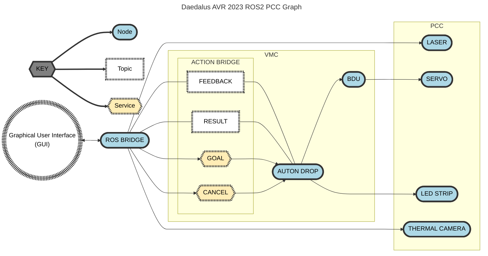

```mermaid
---
title: Daedalus AVR 2023 ROS2 PCC Graph
---

flowchart LR

    classDef node fill:lightBlue,color:black,stroke:#333,stroke-width:4px
    classDef topic fill:white,color:black,stroke:#333,stroke-width:5px, stroke-dasharray: 2 2
    classDef service fill:#ffedb6,color:black,stroke:#333,stroke-width:5px, stroke-dasharray: 2 2
    classDef gui fill:#ffffff,color:black,stroke:#333,stroke-width:7px, stroke-dasharray: 2 2

    
    classDef key fill:gray,color:black,stroke:#333,stroke-width:4px

    legend{{KEY}}:::key==>i1([Node]):::node
    legend==>i2[Topic]:::topic
    legend==>i3{{Service}}:::service
    
    subgraph PCC
        direction TB

        laser([LASER])
        servo([SERVO])
        ledstrip([LED STRIP])
        thermcam([THERMAL CAMERA])
        
    end

    subgraph VMC
        bdu([BDU]) --> servo
        auton_drop([AUTON DROP]) --> ledstrip
        
        subgraph ACTION BRIDGE
            goal{{GOAL}}:::service
            cancel{{CANCEL}}:::service
            feedback[FEEDBACK]:::topic
            result[RESULT]:::topic
        end
    end

    ros_bridge([ROS BRIDGE]) --> laser
    ros_bridge --> thermcam

    GUI((("Graphical User Interface \n (GUI)"))):::gui

    ros_bridge --- feedback --- auton_drop
    ros_bridge --- result --- auton_drop


    ros_bridge --> goal --> auton_drop
    ros_bridge --> cancel --> auton_drop
    auton_drop --> bdu

    GUI <--> ros_bridge

    


  


```
