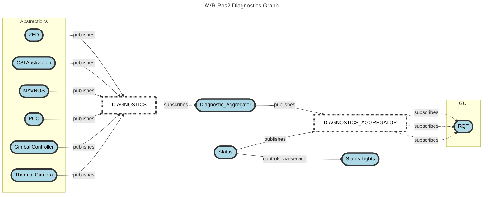

```mermaid
---
title: AVR Ros2 Diagnostics Graph
---
flowchart LR
    
    classDef node fill:lightBlue,color:black,stroke:#333,stroke-width:4px
    classDef topic fill:white,color:black,stroke:#333,stroke-width:5px, stroke-dasharray: 2 2
    
    diagnostics_topic[DIAGNOSTICS]:::topic
    diag_agg([Diagnostic_Aggregator])
    diag_agg_topic[DIAGNOSTICS_AGGREGATOR]:::topic
    status_node([Status])
    status_lights([Status Lights])
    RQT/GUI([RQT])
    
    zed([ZED])
    
   
    
    subgraph Abstractions 
        zed
        CSI_abs
        Mavros
        PCC
        gimcont
        themcam
    end
    
    subgraph GUI 
        RQT/GUI
    end
    
    zed --publishes-->diagnostics_topic
    CSI_abs([CSI Abstraction]) --publishes-->diagnostics_topic
    Mavros([MAVROS]) --publishes-->diagnostics_topic
    PCC([PCC]) --publishes-->diagnostics_topic
    gimcont([Gimbal Controller]) --publishes-->diagnostics_topic
    themcam([Thermal Camera]) --publishes-->diagnostics_topic
    diagnostics_topic -. subscribes .->diag_agg
    diag_agg --publishes-->diag_agg_topic
    status_node --publishes-->diag_agg_topic
    status_node --controls-via-service-->status_lights
    diag_agg_topic -. subscribes .-> RQT/GUI
    diag_agg_topic -. subscribes .-> RQT/GUI
    diag_agg_topic -. subscribes .-> RQT/GUI 

```
