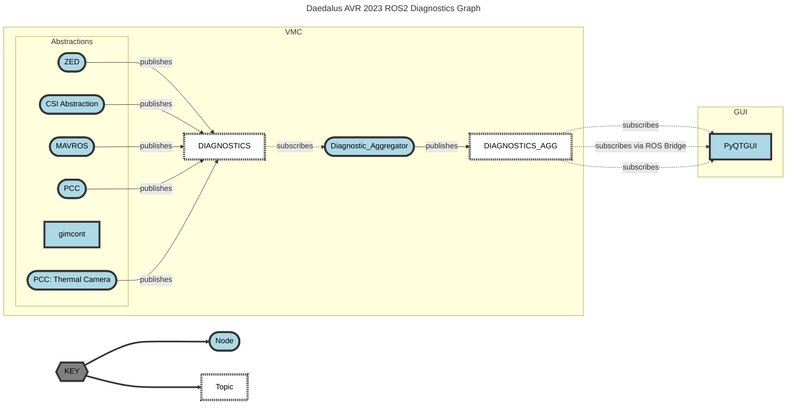

```mermaid
---
title: Daedalus AVR 2023 ROS2 Diagnostics Graph
---
flowchart LR
    
    classDef node fill:lightBlue,color:black,stroke:#333,stroke-width:4px
    classDef topic fill:white,color:black,stroke:#333,stroke-width:5px, stroke-dasharray: 2 2
    classDef key fill:gray,color:black,stroke:#333,stroke-width:4px
    

    subgraph VMC
        direction LR
        diagnostics_topic[DIAGNOSTICS]:::topic
        diag_agg([Diagnostic_Aggregator])
        diag_agg_topic[DIAGNOSTICS_AGG]:::topic
        zed([ZED])
        
        subgraph Abstractions 
            zed
            CSI_abs
            Mavros
            PCC
            gimcont
            themcam
        end
    end

    subgraph GUI 
        PyQTGUI
    end

    legend{{KEY}}:::key==>i1([Node]):::node
    legend==>i2[Topic]:::topic
    
    zed --publishes-->diagnostics_topic
    CSI_abs([CSI Abstraction]) --publishes-->diagnostics_topic
    Mavros([MAVROS]) --publishes-->diagnostics_topic
    PCC([PCC]) --publishes-->diagnostics_topic
    themcam([PCC: Thermal Camera]) --publishes-->diagnostics_topic
    diagnostics_topic -. subscribes .->diag_agg
    diag_agg --publishes-->diag_agg_topic
    diag_agg_topic -. subscribes .-> PyQTGUI
    diag_agg_topic -. subscribes via ROS Bridge .-> PyQTGUI
    diag_agg_topic -. subscribes .-> PyQTGUI 

```
