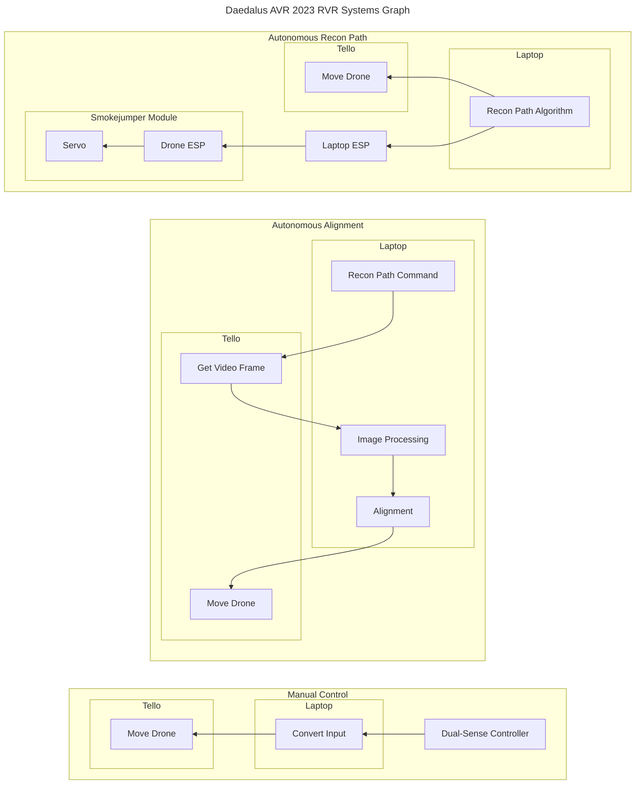

```mermaid
---
title: Daedalus AVR 2023 RVR Systems Graph
---


flowchart LR

    subgraph manual[Manual Control]
        direction RL
        subgraph laptop[Laptop]
            conversion[Convert Input]
        end

        subgraph tello[Tello]
            move[Move Drone]
        end
    
        controller[Dual-Sense Controller] --> conversion --> move

    end

    subgraph alignment[Autonomous Alignment]
        direction TB

        subgraph alaptop[Laptop]
            command[Recon Path Command]
            processing[Image Processing]
            align[Alignment]
        end

        subgraph atello[Tello]
             command --> frame[Get Video Frame] --> processing --> align --> amove[Move Drone]
        end
        

    end

    subgraph reconpath[Autonomous Recon Path]
        direction RL

        subgraph blaptop[Laptop]
            rp[Recon Path Algorithm]
        end

        subgraph smokejumper[Smokejumper Module]
            droneesp[Drone ESP]
            droneesp --> servo[Servo]
        end

        rp --> pcesp[Laptop ESP] --> droneesp

        subgraph btello[Tello]
            rp --> bmove[Move Drone]
        end

        
        

    end

    


  


```
